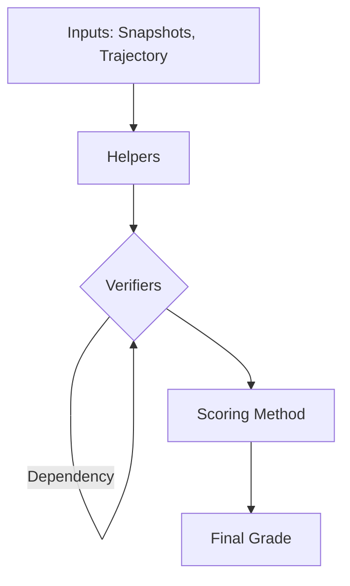

# Archipelago Grading

A modular, extensible grading system for agent trajectories.

This system evaluates agent performance by running a pipeline of **Helpers**, **Verifiers**, and **Scoring Methods**. It is designed to be composable, allowing you to easily add new types of evaluations without modifying the core runner logic.

---

## Core Concepts

The grading pipeline consists of three main stages:

1. **Helpers**: Pre-computation steps that extract common data (e.g., diffing files, parsing logs) to be shared across multiple verifiers.
2. **Verifiers (Evals)**: Individual checks that run against the trajectory and helper data. These can be LLM-based judges, static analysis tools, or domain-specific validators. Verifiers can depend on other verifiers.
3. **Scoring**: A final aggregation step that takes all verifier results and computes a final score for the run.

### Data Flow



---

## 1. Helpers (`runner/helpers`)

Helpers are designed to "compute once, use many times." They run *before* any verifiers.

- **Purpose**: Efficient data extraction (e.g., don't re-download and diff the S3 bucket for every single verifier).
- **Registry**: Defined in `runner/helpers/registry.py`.
- **Implementation**: A simple async function that returns `Any`.

### Creating a New Helper

1. Add a new ID to `HelperIds` in `runner/helpers/models.py`.
2. Implement the logic in a new file under `runner/helpers/`.
3. Register it in `runner/helpers/registry.py`.

```python
# runner/helpers/my_helper/main.py
async def my_helper(
    initial_snapshot: io.BytesIO,
    final_snapshot: io.BytesIO,
    trajectory: AgentTrajectoryOutput
) -> dict:
    # logic here
    return {"result": "data"}
```

---

## 2. Verifiers / Evals (`runner/evals`)

Verifiers are the core units of grading. Each verifier is an instance of an **Eval Definition**.

- **Eval Defn**: The "class" of evaluation (e.g., `OUTPUT_LLM`, `SQL_VALIDATOR`). Defined in code.
- **Verifier**: An instance of that class configured for a specific task.
- **Registry**: Defined in `runner/evals/registry.py`.

### Creating a New Eval

1. Add a new ID to `EvalIds` in `runner/evals/models.py`.
2. Create the implementation in `runner/evals/`. It receives an `EvalImplInput` object.
3. Register it in `runner/evals/registry.py`, specifying helper dependencies and config fields.
4. For any path where your eval cannot reach a verdict, follow
   [Reporting a criterion you could not judge](#reporting-a-criterion-you-could-not-judge).

```python
# runner/evals/registry.py
EVAL_REGISTRY = {
    EvalIds.MY_EVAL: EvalDefn(
        eval_id=EvalIds.MY_EVAL,
        eval_impl=my_eval_impl,
        helper_dependencies=[HelperIds.SNAPSHOT_DIFF],
        eval_config_fields=[],
        verifier_config_fields=[
            TaskFieldSchema(field_id="threshold", field_type=TaskFieldType.NUMBER, label="Threshold")
        ],
        verifier_output_fields=[],
    )
}
```

### Reporting a criterion you could not judge

**Use `runner/utils/ungradeable.py`. Never return a bare `0.0` for a failure to
evaluate.**

`VerifierResult.score` is a required float, so a verifier that reaches no
verdict still has to put a number on the row, and `0.0` is the only one
available. Nothing else distinguishes that from a criterion the agent genuinely
failed, so a missing helper result, an unparseable artifact or a judge
exception all get scored as model failures. Those numbers reach leaderboards,
customer reports and RL rewards, where they are indistinguishable from real
ones.

The convention has one invariant:

> A row carries a score only if it was scored.

```python
from runner.utils.ungradeable import ungradeable_result

if input.final_snapshot_bytes is None:
    return ungradeable_result(
        input,
        "no final snapshot, so there was nothing to read",
        cause="snapshot_unreadable",
        values={"check_name": check_name},
    )
```

The constructor sets `status=ERROR`, which 17 of the 20 scoring methods already
treat as "do not score this run". It omits every score key from
`verifier_result_values`, and it raises if you pass one, so a warehouse sum
cannot count a voided grade as a real zero.

#### Which of the three states is this?

There are three, not two. Ask who caused it, then whether there was anything to
judge.

| Situation | Treatment | Scored? |
| --- | --- | --- |
| Snapshot missing or unreadable | `ungradeable_result(..., cause="snapshot_unreadable")` | no, run is void |
| Container ran out of disk | `cause="disk_exhausted"` | no, run is void |
| Deliverable truncated during extraction | `cause="deliverable_truncated"` | no, run is void |
| Every candidate file over the size caps | `cause="all_files_over_caps"` | no, run is void |
| No snapshot database would open | `cause="all_databases_failed_to_load"` | no, run is void |
| Judge model unavailable | `cause="model_unavailable"` | no, run is void |
| Judge reached no verdict | `cause="no_verdict"` | no, run is void |
| Judge refused to answer | `cause="judge_declined"` | no, run is void |
| Verifier is misconfigured | `cause="config_error"` | no, run is void |
| Agent produced no deliverable at all | `no_deliverable_result(...)` | yes, `0.0` |
| Agent produced it and it is wrong | plain scored `0.0` | yes, `0.0` |

Those nine causes are the ones something emits today, all from
`agentic_verifier`. If your situation needs one that is not listed, that is
expected and it means you are the first call site; see
[Adding a new cause](#adding-a-new-cause). Do not stretch an existing cause to
fit, because a query groups on it.

`no_deliverable_result` is the middle state and it is easy to skip. The grader
worked, so the run is not void and the `0.0` counts. The marker exists so the
case stays findable afterwards, which is what separates an agent that had
nothing to say from an agent that was handed an empty environment. The second
looks identical on the grade row without it.

#### Registering a new eval

Nothing extra. `soft_causes()` reads `eval_config_values` off the world, so the
opt-in already works for your eval without it declaring anything.

Do not copy `ungradeable_soft_causes` into your `eval_config_fields`. The field
belongs on every `EvalDefn`, and `EVAL_REGISTRY` has 135 entries across two
hand-mirrored registries, so declaring it per eval is 270 near-identical
blocks. It is being injected once for all of them instead, and that has not
landed yet. `agentic_verifier` declares it today and is the exception, not the
pattern to copy.

#### Adding a new cause

Only when no existing cause fits. Causes are a closed set so a warehouse query
can group on `ungradeable_cause` instead of parsing the English in `reason`.

1. Add it to `UNGRADEABLE_CAUSES` in `runner/utils/ungradeable.py`, the owner.
2. Add it to the `_AV_UNGRADEABLE_CAUSES` literal in `runner/evals/registry.py`.
   It is restated and not imported, because `scripts/sync_eval_definitions.sh`
   copies that block verbatim into the server registry, which cannot resolve an
   archipelago import. `test_registry_defaults_match_the_runner` pins the two
   together, so getting this wrong fails the build instead of drifting.
3. Run `bash scripts/sync_eval_definitions.sh` and commit the regenerated
   `rl-studio/server/grading_definitions/evals/registry.py`. Never hand-edit
   that file; CI re-runs the sync and rejects the diff.

#### Fatal by default

A cause voids the grading run. A world that would lose an 80-criterion rubric
over one unjudgeable criterion can list that cause in
`ungradeable_soft_causes`, which scores it `0.0` instead. The list is empty by
default. Infrastructure causes are usually best left fatal, because the grade
really is void.

---

## 3. Scoring Methods (`runner/scoring_methods`)

The scoring method takes the list of all `VerifierResult` objects and reduces them to a single `ScoringMethodResult`.

- **Purpose**: Flexible grading policies (e.g., weighted sum, pass/fail thresholds).
- **Registry**: Defined in `runner/scoring_methods/registry.py`.

### Creating a New Scoring Method

1. Add a new ID to `ScoringMethodIds` in `runner/scoring_methods/models.py`.
2. Implement the reduction logic.
3. Register it in `runner/scoring_methods/registry.py`.

---

### Structured critical-criteria counts

An `agentic_verifier` can opt into identified criteria by setting
`criterion_definitions` in its `verifier_values`. Supply the complete authored
criterion list with unique IDs and explicit boolean criticality:

```json
[
  {"criterion_id": "owner", "criterion": "Name an owner for every row", "critical": true},
  {"criterion_id": "style", "criterion": "Use concise headings", "critical": false}
]
```

Grader Guidance remains required for context. The judge returns the declared
IDs and met/not-met results. The evaluator retains the authored definitions
with the result; criticality is never taken from the judge's response or
inferred from prose, difficulty, or primary-objective flags.

Every scoring method emits `critical_criteria_total` and `critical_criteria_met`
in `scoring_method_result_values` when the verifiers in scope declare
`criterion_definitions`. There is no flag: the authored definitions are the
trigger. It selects structured verifiers by their configured IDs and saved
definitions, including agentic results excluded from the numeric score, and
each needs a valid result and a complete, uniquely identified guidance ledger.
Beyond-guidance observations and non-critical criteria do not enter the counts.
An empty delivery keeps its valid zero grade and reports every authored
criterion as unmet.

A scope that declares no definitions emits neither key, because criticality
does not apply to it. Where definitions are declared, both counts come back
`null` if a result is incomplete, ungradeable or salvaged, or if the ledger does
not cover the definitions exactly; display that as unavailable, not zero or
passing, and note the reason is logged. A rubric with no critical criteria is
not one of those cases: it reports `0` and `0`, which is valid and must not be
divided into a rate. The reporter does not suppress errors from the numeric
scoring method.

Filtered rescoring reports counts for its selected verifier scope when that
scope has valid structured metadata. It does not fetch omitted verifiers or
claim whole-grade completion. The task-level solvability card must read the
golden's full grading run, not a filtered scoring run.

The option defaults off and does not change the final-score calculation.
Legacy agentic grading without definitions retains its existing prompt,
response schema and result shape. Obi's verifier-level tags and gated scoring
method are unchanged. Existing grades are not backfilled, and no world is
automatically opted in. These counts describe the graded attempt; selecting
the golden's latest completed grade for display is a separate reader concern.

## Usage

### Prerequisites

1. **Set up environment variables:**

   ```bash
   cp .env.example .env
   # Edit .env with your LLM API key
   ```

2. **Install dependencies:**

   ```bash
   uv sync
   ```

### CLI

Run the grading system locally using the CLI:

```bash
uv run python -m runner.main \
  --grading-run-id "run_123" \
  --trajectory-id "traj_456" \
  --initial-snapshot "./original.zip" \
  --final-snapshot "./final.zip" \
  --trajectory "./trajectory.json" \
  --grading-settings "./settings.json" \
  --verifiers "./verifiers.json" \
  --eval-configs "./eval_configs.json" \
  --scoring-config "./scoring_config.json" \
  --output "./results.json"
```

### Creating Config Files

The grading runner requires several configuration files. Here's how to create them:

**1. `grading_settings.json`** - LLM judge configuration:

```json
{
  "llm_judge_model": "anthropic/claude-3-5-sonnet-20241022",
  "llm_judge_extra_args": null
}
```

**2. `verifiers.json`** - Grading criteria:

```json
[
  {
    "verifier_id": "ver_001",
    "verifier_version": 1,
    "world_id": null,
    "task_id": "my_task",
    "eval_config_id": "ec_output_llm",
    "verifier_values": {
      "criteria": "The agent successfully completed the requested task",
      "is_primary_objective": true
    },
    "verifier_index": 0,
    "verifier_dependencies": null
  }
]
```

**3. `eval_configs.json`** - Eval definitions:

```json
[
  {
    "eval_config_id": "ec_output_llm",
    "eval_config_name": "Output LLM Verifier",
    "eval_defn_id": "output_llm",
    "eval_config_values": {}
  }
]
```

Available eval IDs:
- `output_llm` - LLM-based output evaluation
- `output_llm_lite` - Lightweight output evaluation

**4. `scoring_config.json`** - Score calculation:

```json
{
  "scoring_config_id": "sc_default",
  "scoring_config_name": "Default Scoring",
  "scoring_defn_id": "task_score_unweighted_and_universal_penalty",
  "scoring_config_values": {
    "task_primary_objective_scaling_factor": 2.0,
    "task_non_primary_objective_scaling_factor": 1.0,
    "task_negative_scaling_factor": 2.0,
    "universal_penalty_cap": 0.2,
    "final_score_ceiling": 1.0,
    "final_score_floor": 0.0
  }
}
```

### Snapshot Format

> **Important**: The grading system expects `.zip` files for snapshots. If you have `.tar.gz` files from the environment, convert them first:

```python
import tarfile
import zipfile

def tar_gz_to_zip(tar_gz_path: str, zip_path: str):
    with tarfile.open(tar_gz_path, "r:gz") as tar:
        with zipfile.ZipFile(zip_path, "w", zipfile.ZIP_DEFLATED) as zf:
            for member in tar.getmembers():
                if member.isfile():
                    f = tar.extractfile(member)
                    if f is not None:
                        zf.writestr(member.name, f.read())

tar_gz_to_zip("snapshot.tar.gz", "snapshot.zip")
```

---

## Core Data Models

### `EvalImplInput` (`runner/evals/models.py`)
The context object passed to every verifier implementation.
- `initial_snapshot_bytes` / `final_snapshot_bytes`: Raw zip files (as `io.BytesIO`)
- `trajectory`: Full conversation history and metadata
- `grading_settings`: Global settings (e.g., LLM judge model)
- `verifier`: Configuration for *this* check instance
- `eval_config`: Configuration for the *type* of eval
- `dependencies`: Results from other verifiers this one depends on
- `helper_results`: Output of all pre-computed helpers

### `VerifierResult` (`runner/models.py`)
The output of a single verifier execution.
- `verifier_id`: ID of the verifier that produced this result
- `verifier_version`: Version for point-in-time accuracy
- `score`: Float score (typically 0.0 to 1.0). Required, so it is `0.0` even on
  a row that was never scored. See
  [Reporting a criterion you could not judge](#reporting-a-criterion-you-could-not-judge)
  before returning `0.0` for a failure to evaluate.
- `verifier_result_values`: Flexible dict for metadata (reasoning, errors, etc.)
- `status`: `ok` or `error`
- `message`: Optional context message

### `GradingSettings` (`runner/models.py`)
Global settings for the grading run.
- `llm_judge_model`: Model for LLM-based verifiers
- `llm_judge_extra_args`: Additional LLM arguments

### `ScoringMethodResult` (`runner/models.py`)
The final aggregated output.
- `final_score`: Single float score
- `scoring_method_result_values`: Breakdown of calculation
